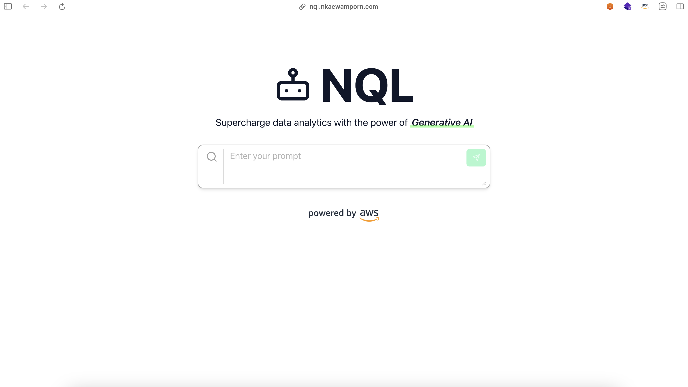

# NQL

An application which aims to democratize data-driven insights with the power of Generative AI on Amazon Bedrock

## Status

The project is currently in late stage of development. While there are somethings yet to be improved on, it's a fully working demo that can be used commercially.

## Project Screenshot


## Setup

This project uses [pnpm](https://pnpm.io/) as the package manager

Install project dependencies
```bash
pnpm install
```

Copy environment variables
```bash
cp .env.template .env
```

## Running Local server
To run development server:
```bash
pnpm dev
```

To run production server:
```bash
pnpm build && pnpm start
```

Visit app at `http://localhost:3000`

## Deployment

Please refer to AWS Amplify Deployment via this blog: [Deploy a Next.js 13 app to AWS with Amplify Hosting](https://aws.amazon.com/blogs/mobile/amplify-next-js-13/)